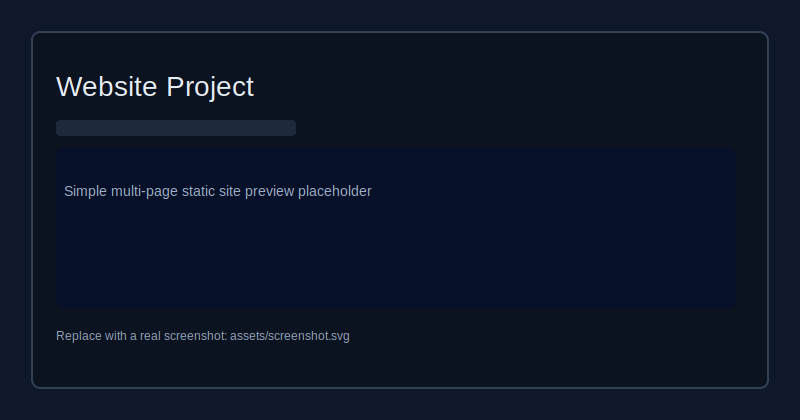

# Website Project

[](https://github.com/GEN-BIT/website-project/actions/workflows/deploy.yml)
[](https://GEN-BIT.github.io/website-project/)

A polished static website repository with multiple HTML pages, page-specific CSS, shared styling, and a small JavaScript theme helper.

## Table of Contents

- [What’s inside](#whats-inside)
- [Features](#features)
- [Run locally](#run-locally)
- [Publish with GitHub Pages](#publish-with-github-pages)
- [Contributing](#contributing)
- [License](#license)

## What’s inside

- `index.html` / `index.css`: Home page and main landing styles
- `about.html` / `about.css`: About page for school or organization details
- `services.html` / `services.css`: Services page for offerings or program highlights
- `gallery.html` / `gallery.css`: Gallery page for images and visual content
- `contact.html` / `contact.css`: Contact page for messages and contact information
- `shared.css`: Shared styles for consistent site design
- `theme.js`: Theme behavior and interactive script for the site

## Features

- Simple page structure for easy editing and updates
- Separate CSS files keep styling organized per page
- Shared stylesheet provides consistent look and feel
- Static HTML/CSS/JS setup works without a build step
- GitHub Actions workflow included for optional Pages deployment

## Run locally

Open any `.html` file in your browser to preview the site.

For a local HTTP preview, run this from the repo root:

```bash
# Python 3
python -m http.server 8000
```

Then open:

```text
http://localhost:8000
```

## Publish with GitHub Pages

This repository includes a GitHub Actions workflow at `.github/workflows/deploy.yml` that deploys the site automatically on every push to `master`.

To enable it:

1. Push the repo to GitHub.
2. Go to repository settings → Pages.
3. Set source to the `master` branch and root.

The public site will be available at:

```text
https://gen-bit.github.io/website-project/
```

If you prefer a branch-based deploy flow such as `gh-pages`, I can add an alternate workflow.

## Contributing

Found a bug or want to improve something? Please open an issue or submit a pull request.

See `CONTRIBUTING.md` for a short guide.

## License

This project is available under the MIT License — see `LICENSE` for details.

## Preview



> Replace `assets/screenshot.svg` with a real screenshot once you have one.
